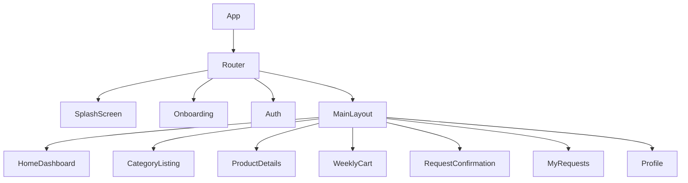
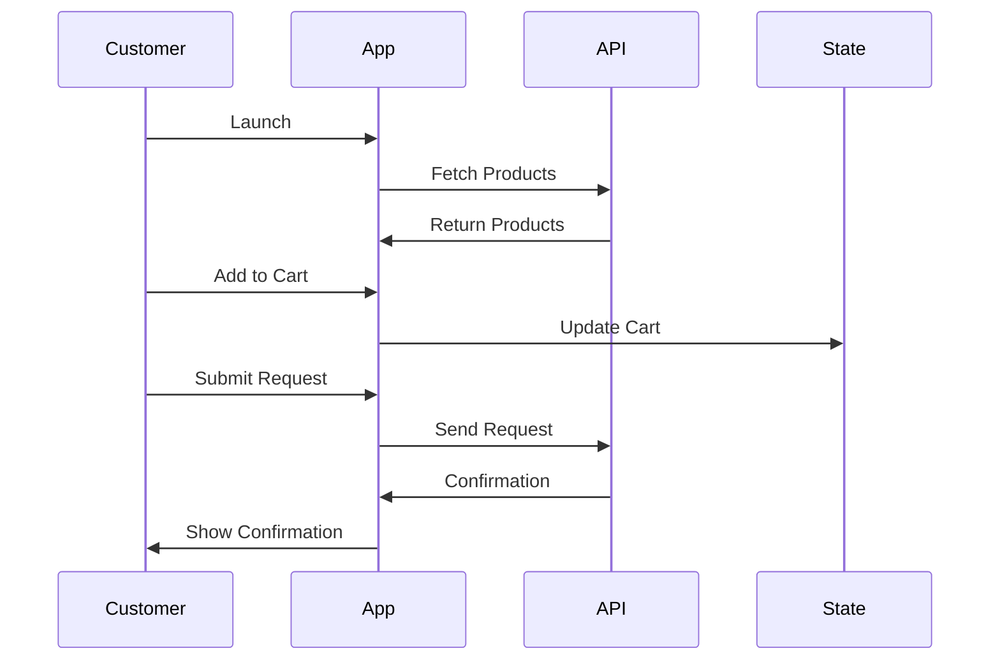

# Customer App Strategy - Farm Fresh E-Commerce Platform

## Executive Summary

This document outlines the comprehensive strategy for developing a customer-facing mobile/web application for a farm-to-consumer e-commerce platform. The app will connect certified farmers directly with consumers through a weekly subscription model.

## Current Project Analysis

### Existing Structure
- React-based application using Vite
- React Router DOM for navigation
- Tailwind CSS for styling
- Current structure shows a sidebar-based admin dashboard template
- Needs to be adapted for customer-facing mobile/web experience

### Key Observations
- Current project is set up for admin/dashboard use
- Needs transformation to customer-focused UX
- Existing routing and component structure can be leveraged
- Tailwind CSS provides good foundation for responsive design

## Strategic Vision

### Core Value Proposition
"Pure Food from Certified Farmers - Direct from Farm to Your Table"

### Business Model
- Weekly subscription-based delivery
- Farm-fresh produce with certification guarantee
- Direct farmer-to-consumer connection
- Weekly combo packs for convenience

### Target Audience
- Health-conscious urban consumers
- Families looking for fresh, certified produce
- Busy professionals wanting convenient weekly deliveries
- Environmentally aware consumers supporting local farmers

## Technical Architecture

### Component Structure



### Data Flow



## Page-by-Page Implementation Strategy

### 1. Splash Screen
**Purpose**: Brand introduction and first impression
**Components**:
- Logo with animation
- Tagline: "Pure Food from Certified Farmers"
- Loading indicator
- Auto-redirect after 3 seconds

**Technical Implementation**:
```jsx
// SplashScreen.jsx
const SplashScreen = () => {
  const [loading, setLoading] = useState(true);

  useEffect(() => {
    const timer = setTimeout(() => {
      setLoading(false);
    }, 3000);
    return () => clearTimeout(timer);
  }, []);

  if (!loading) return <Navigate to="/onboarding" />;

  return (
    <div className="flex flex-col items-center justify-center min-h-screen bg-gradient-to-br from-green-100 to-emerald-200">
      <motion.div
        initial={{ scale: 0.8 }}
        animate={{ scale: 1 }}
        transition={{ duration: 0.8 }}
      >
        
      </motion.div>
      <h1 className="text-3xl font-bold text-green-800 mt-4">Pure Food from Certified Farmers</h1>
      <div className="mt-8">
        <LoadingSpinner />
      </div>
    </div>
  );
};
```

### 2. Onboarding Screens
**Purpose**: Educate users about the platform benefits
**Structure**: 3-slide carousel with skip/next buttons

**Slide Content**:
1. **Direct From Farm**
   - Visual: Farmer with fresh produce
   - Text: "Fresh produce delivered directly from certified farms"
   - Highlight: "No middlemen, just freshness"

2. **Pure & Certified**
   - Visual: Certification badge animation
   - Text: "All products certified for quality and purity"
   - Highlight: "100% natural, no chemicals"

3. **Weekly Subscription Model**
   - Visual: Calendar with delivery dates
   - Text: "Weekly deliveries at your convenience"
   - Highlight: "Customize your weekly basket"

**Technical Implementation**:
```jsx
// Onboarding.jsx
const Onboarding = () => {
  const [currentSlide, setCurrentSlide] = useState(0);
  const [isLastSlide, setIsLastSlide] = useState(false);

  const slides = [
    {
      title: "Direct From Farm",
      description: "Fresh produce delivered directly from certified farms. No middlemen, just freshness.",
      image: "/onboarding1.png",
      highlight: "Farm to Table in 24 hours"
    },
    // ... other slides
  ];

  const handleNext = () => {
    if (currentSlide < slides.length - 1) {
      setCurrentSlide(currentSlide + 1);
    } else {
      setIsLastSlide(true);
    }
  };

  if (isLastSlide) return <Navigate to="/auth" />;

  return (
    <div className="min-h-screen bg-white">
      <div className="p-6">
        <button onClick={() => setIsLastSlide(true)} className="float-right text-gray-500">Skip</button>
      </div>
      <div className="flex flex-col items-center justify-center px-4 py-8">
        
        <h2 className="text-2xl font-bold text-green-800 mb-4">{slides[currentSlide].title}</h2>
        <p className="text-gray-600 text-center mb-2">{slides[currentSlide].description}</p>
        <p className="text-green-600 font-semibold">{slides[currentSlide].highlight}</p>
      </div>

      <div className="flex justify-between items-center px-6 py-8">
        <div className="flex space-x-2">
          {slides.map((_, index) => (
            <div key={index} className={`w-2 h-2 rounded-full ${index === currentSlide ? 'bg-green-500' : 'bg-gray-300'}`}></div>
          ))}
        </div>
        <button
          onClick={handleNext}
          className="bg-green-600 text-white px-6 py-2 rounded-full font-semibold hover:bg-green-700 transition-colors"
        >
          {currentSlide === slides.length - 1 ? "Get Started" : "Next"}
        </button>
      </div>
    </div>
  );
};
```

### 3. Authentication System
**Purpose**: User registration and login
**Flow**: Mobile OTP-based authentication

**Components**:
- Mobile number input with validation
- OTP verification screen
- User profile setup (name, address)
- Optional referral code input

**Technical Implementation**:
```jsx
// Auth.jsx
const Auth = () => {
  const [phone, setPhone] = useState('');
  const [otp, setOtp] = useState('');
  const [step, setStep] = useState('phone'); // phone, otp, profile
  const [userData, setUserData] = useState({});

  const handlePhoneSubmit = async () => {
    // Validate phone number
    if (!phone.match(/^[6-9]\d{9}$/)) {
      toast.error("Please enter a valid mobile number");
      return;
    }

    // Send OTP API call
    try {
      const response = await api.post('/auth/send-otp', { phone });
      if (response.data.success) {
        setStep('otp');
      }
    } catch (error) {
      toast.error("Failed to send OTP");
    }
  };

  const handleOtpSubmit = async () => {
    if (otp.length !== 6) {
      toast.error("Please enter 6-digit OTP");
      return;
    }

    try {
      const response = await api.post('/auth/verify-otp', { phone, otp });
      if (response.data.success) {
        setUserData(response.data.user || {});
        setStep('profile');
      }
    } catch (error) {
      toast.error("Invalid OTP");
    }
  };

  const handleProfileSubmit = async (profileData) => {
    try {
      const response = await api.post('/auth/complete-profile', {
        ...profileData,
        phone
      });
      if (response.data.success) {
        // Store auth token
        localStorage.setItem('token', response.data.token);
        navigate('/home');
      }
    } catch (error) {
      toast.error("Failed to complete profile");
    }
  };

  return (
    <div className="min-h-screen bg-gradient-to-br from-green-50 to-emerald-100 p-6">
      <div className="max-w-md mx-auto bg-white rounded-2xl shadow-lg p-8">
        <div className="text-center mb-8">
          
          <h1 className="text-2xl font-bold text-green-800">Welcome to Farm Fresh</h1>
        </div>

        {step === 'phone' && (
          <PhoneStep
            phone={phone}
            setPhone={setPhone}
            onSubmit={handlePhoneSubmit}
          />
        )}

        {step === 'otp' && (
          <OtpStep
            otp={otp}
            setOtp={setOtp}
            onSubmit={handleOtpSubmit}
            onResend={() => handlePhoneSubmit()}
          />
        )}

        {step === 'profile' && (
          <ProfileStep
            userData={userData}
            onSubmit={handleProfileSubmit}
          />
        )}
      </div>
    </div>
  );
};
```

### 4. Home Dashboard
**Purpose**: Main landing page with all key sections
**Sections**:
- Search bar with autocomplete
- Categories grid
- Featured farmers/products
- Weekly combo packs
- Request status

**Technical Implementation**:
```jsx
// HomeDashboard.jsx
const HomeDashboard = () => {
  const [searchQuery, setSearchQuery] = useState('');
  const [featuredProducts, setFeaturedProducts] = useState([]);
  const [comboPacks, setComboPacks] = useState([]);
  const [activeRequest, setActiveRequest] = useState(null);

  useEffect(() => {
    const fetchData = async () => {
      try {
        const [productsResponse, packsResponse, requestResponse] = await Promise.all([
          api.get('/products/featured'),
          api.get('/products/combo-packs'),
          api.get('/requests/active')
        ]);

        setFeaturedProducts(productsResponse.data);
        setComboPacks(packsResponse.data);
        setActiveRequest(requestResponse.data);
      } catch (error) {
        toast.error("Failed to load data");
      }
    };

    fetchData();
  }, []);

  const categories = [
    { name: "Vegetables", icon: "🥬", route: "/category/vegetables" },
    { name: "Grains", icon: "🌾", route: "/category/grains" },
    { name: "Oil", icon: "🫒", route: "/category/oil" },
    { name: "Milk", icon: "🥛", route: "/category/milk" },
    { name: "Eggs", icon: "🥚", route: "/category/eggs" },
    { name: "Chicken", icon: "🍗", route: "/category/chicken" },
  ];

  return (
    <div className="min-h-screen bg-gray-50">
      {/* Search Bar */}
      <div className="p-4 bg-white shadow-sm">
        <div className="relative">
          <input
            type="text"
            placeholder="Search for fresh produce..."
            value={searchQuery}
            onChange={(e) => setSearchQuery(e.target.value)}
            className="w-full pl-12 pr-4 py-3 rounded-full border border-gray-200 focus:outline-none focus:ring-2 focus:ring-green-500"
          />
          <div className="absolute left-4 top-3 text-gray-400">
            <svg className="w-5 h-5" fill="none" stroke="currentColor" viewBox="0 0 24 24">
              <path strokeLinecap="round" strokeLinejoin="round" strokeWidth={2} d="M21 21l-6-6m2-5a7 7 0 11-14 0 7 7 0 0114 0z" />
            </svg>
          </div>
        </div>
      </div>

      {/* Categories */}
      <div className="p-4">
        <h2 className="text-lg font-semibold text-gray-800 mb-4">Shop by Category</h2>
        <div className="grid grid-cols-3 gap-4">
          {categories.map((category) => (
            <Link key={category.name} to={category.route} className="bg-white rounded-xl p-4 text-center shadow-sm hover:shadow-md transition-shadow">
              <div className="text-3xl mb-2">{category.icon}</div>
              <div className="text-sm font-medium text-gray-700">{category.name}</div>
            </Link>
          ))}
        </div>
      </div>

      {/* Featured Products */}
      <div className="p-4 mt-6">
        <div className="flex justify-between items-center mb-4">
          <h2 className="text-lg font-semibold text-gray-800">Featured This Week</h2>
          <Link to="/featured" className="text-green-600 text-sm">See All</Link>
        </div>
        <div className="flex overflow-x-auto space-x-4 pb-4">
          {featuredProducts.map((product) => (
            <ProductCard key={product.id} product={product} />
          ))}
        </div>
      </div>

      {/* Combo Packs */}
      <div className="p-4 mt-6 bg-white">
        <h2 className="text-lg font-semibold text-gray-800 mb-4">Weekly Combo Packs</h2>
        <div className="space-y-4">
          {comboPacks.map((pack) => (
            <ComboPackCard key={pack.id} pack={pack} />
          ))}
        </div>
      </div>

      {/* Request Status */}
      {activeRequest && (
        <div className="p-4 mt-6">
          <div className="bg-green-50 border border-green-200 rounded-xl p-4">
            <div className="flex justify-between items-start">
              <div>
                <h3 className="font-semibold text-green-800">Your Weekly Request</h3>
                <p className="text-sm text-gray-600">Status: {activeRequest.status}</p>
                <p className="text-sm text-gray-600">Delivery: {activeRequest.deliveryDate}</p>
              </div>
              <Link to="/requests/active" className="text-green-600 text-sm">View Details</Link>
            </div>
            <div className="mt-3 flex space-x-2">
              {activeRequest.items.slice(0, 3).map((item) => (
                
              ))}
              {activeRequest.items.length > 3 && (
                <div className="w-12 h-12 bg-gray-100 rounded-lg flex items-center justify-center text-xs">+{activeRequest.items.length - 3}</div>
              )}
            </div>
          </div>
        </div>
      )}
    </div>
  );
};
```

### 5. Category Listing Page
**Purpose**: Display all products in a category with filters
**Features**:
- Product grid with images and prices
- Filter sidebar (price, seasonal, organic, weekly delivery)
- Sort options
- Search within category

**Technical Implementation**:
```jsx
// CategoryListing.jsx
const CategoryListing = () => {
  const { categoryId } = useParams();
  const [products, setProducts] = useState([]);
  const [loading, setLoading] = useState(true);
  const [filters, setFilters] = useState({
    priceRange: [0, 1000],
    seasonal: false,
    organic: false,
    weeklyDelivery: true
  });
  const [sortBy, setSortBy] = useState('popularity');

  useEffect(() => {
    const fetchProducts = async () => {
      setLoading(true);
      try {
        const params = new URLSearchParams({
          category: categoryId,
          ...filters,
          sortBy
        });

        const response = await api.get(`/products?${params.toString()}`);
        setProducts(response.data);
      } catch (error) {
        toast.error("Failed to load products");
      } finally {
        setLoading(false);
      }
    };

    fetchProducts();
  }, [categoryId, filters, sortBy]);

  const handleFilterChange = (newFilters) => {
    setFilters(prev => ({ ...prev, ...newFilters }));
  };

  return (
    <div className="min-h-screen bg-gray-50">
      <div className="p-4">
        <div className="flex justify-between items-center mb-4">
          <h1 className="text-xl font-bold text-gray-800 capitalize">{categoryId}</h1>
          <div className="flex items-center space-x-2">
            <select
              value={sortBy}
              onChange={(e) => setSortBy(e.target.value)}
              className="px-3 py-1 border border-gray-200 rounded-md text-sm"
            >
              <option value="popularity">Popular</option>
              <option value="price-low">Price: Low to High</option>
              <option value="price-high">Price: High to Low</option>
              <option value="rating">Top Rated</option>
            </select>
            <button className="p-2 border border-gray-200 rounded-md">
              <svg className="w-5 h-5" fill="none" stroke="currentColor" viewBox="0 0 24 24">
                <path strokeLinecap="round" strokeLinejoin="round" strokeWidth={2} d="M12 6V4m0 2a2 2 0 100 4m0-4a2 2 0 110 4m-6 8a2 2 0 100-4m0 4a2 2 0 100 4m0-4v2m0-6V4m6 6v10m6-2a2 2 0 100-4m0 4a2 2 0 100 4m0-4v2m0-6V4" />
              </svg>
            </button>
          </div>
        </div>

        {/* Filters */}
        <div className="bg-white rounded-xl p-4 mb-6 shadow-sm">
          <div className="grid grid-cols-2 gap-4">
            <div className="flex items-center">
              <input
                type="checkbox"
                id="seasonal"
                checked={filters.seasonal}
                onChange={() => handleFilterChange({ seasonal: !filters.seasonal })}
                className="rounded border-gray-300 text-green-600 focus:ring-green-500"
              />
              <label htmlFor="seasonal" className="ml-2 text-sm text-gray-700">Seasonal</label>
            </div>
            <div className="flex items-center">
              <input
                type="checkbox"
                id="organic"
                checked={filters.organic}
                onChange={() => handleFilterChange({ organic: !filters.organic })}
                className="rounded border-gray-300 text-green-600 focus:ring-green-500"
              />
              <label htmlFor="organic" className="ml-2 text-sm text-gray-700">Organic</label>
            </div>
            <div className="flex items-center">
              <input
                type="checkbox"
                id="weeklyDelivery"
                checked={filters.weeklyDelivery}
                onChange={() => handleFilterChange({ weeklyDelivery: !filters.weeklyDelivery })}
                className="rounded border-gray-300 text-green-600 focus:ring-green-500"
              />
              <label htmlFor="weeklyDelivery" className="ml-2 text-sm text-gray-700">Weekly Delivery</label>
            </div>
          </div>
        </div>

        {/* Products Grid */}
        {loading ? (
          <div className="grid grid-cols-2 gap-4">
            {[...Array(6)].map((_, index) => (
              <ProductCardSkeleton key={index} />
            ))}
          </div>
        ) : (
          <div className="grid grid-cols-2 gap-4">
            {products.map((product) => (
              <ProductCard key={product.id} product={product} />
            ))}
          </div>
        )}
      </div>
    </div>
  );
};
```

### 6. Product Details Page
**Purpose**: Detailed information about a single product
**Sections**:
- Product image carousel
- Farmer information (optional for phase 1)
- Description and benefits
- Price and quantity selector
- Add to weekly request button
- Delivery information

**Technical Implementation**:
```jsx
// ProductDetails.jsx
const ProductDetails = () => {
  const { productId } = useParams();
  const [product, setProduct] = useState(null);
  const [loading, setLoading] = useState(true);
  const [quantity, setQuantity] = useState(1);
  const [selectedImage, setSelectedImage] = useState(0);
  const { addToCart } = useCart();

  useEffect(() => {
    const fetchProduct = async () => {
      setLoading(true);
      try {
        const response = await api.get(`/products/${productId}`);
        setProduct(response.data);
      } catch (error) {
        toast.error("Failed to load product details");
      } finally {
        setLoading(false);
      }
    };

    fetchProduct();
  }, [productId]);

  const handleAddToCart = () => {
    addToCart({
      ...product,
      quantity,
      deliveryDay: product.deliveryDays[0] // Default to first available day
    });
    toast.success("Added to your weekly request!");
  };

  if (loading) return <ProductDetailsSkeleton />;
  if (!product) return <NotFound />;

  return (
    <div className="min-h-screen bg-white">
      {/* Image Gallery */}
      <div className="relative">
        <div className="h-64 w-full">
          
        </div>
        <div className="absolute bottom-4 left-0 right-0">
          <div className="flex justify-center space-x-2">
            {product.images.map((image, index) => (
              <button
                key={index}
                onClick={() => setSelectedImage(index)}
                className={`w-12 h-12 rounded-lg border-2 ${index === selectedImage ? 'border-green-500' : 'border-transparent'}`}
              >
                
              </button>
            ))}
          </div>
        </div>
      </div>

      {/* Product Info */}
      <div className="p-4">
        <div className="flex justify-between items-start mb-2">
          <div>
            <h1 className="text-xl font-bold text-gray-800">{product.name}</h1>
            <p className="text-sm text-gray-600">{product.category}</p>
          </div>
          <div className="bg-green-100 text-green-800 px-2 py-1 rounded-full text-xs font-semibold">
            {product.certification}
          </div>
        </div>

        {/* Farmer Info (Optional) */}
        {product.farmer && (
          <div className="flex items-center mb-4 p-3 bg-green-50 rounded-lg">
            
            <div>
              <p className="font-semibold text-sm">{product.farmer.name}</p>
              <p className="text-xs text-gray-600">{product.farmer.location}</p>
            </div>
          </div>
        )}

        {/* Description */}
        <div className="mb-4">
          <h3 className="font-semibold text-gray-800 mb-2">About this product</h3>
          <p className="text-sm text-gray-600">{product.description}</p>
        </div>

        {/* Benefits */}
        <div className="mb-4">
          <h3 className="font-semibold text-gray-800 mb-2">Benefits</h3>
          <ul className="space-y-1 text-sm text-gray-600">
            {product.benefits.map((benefit, index) => (
              <li key={index} className="flex items-start">
                <span className="text-green-500 mr-2">•</span>
                {benefit}
              </li>
            ))}
          </ul>
        </div>

        {/* Price and Quantity */}
        <div className="mb-6">
          <div className="flex justify-between items-center mb-3">
            <span className="text-sm text-gray-600">Price</span>
            <span className="text-lg font-bold text-green-800">₹{product.price}/kg</span>
          </div>

          <div className="flex justify-between items-center mb-4">
            <span className="text-sm text-gray-600">Quantity</span>
            <div className="flex items-center border border-gray-200 rounded-lg">
              <button
                onClick={() => setQuantity(Math.max(1, quantity - 1))}
                className="px-3 py-1 text-gray-500 hover:text-gray-700"
              >
                -
              </button>
              <span className="px-4 py-1 border-l border-r border-gray-200">{quantity}</span>
              <button
                onClick={() => setQuantity(quantity + 1)}
                className="px-3 py-1 text-gray-500 hover:text-gray-700"
              >
                +
              </button>
            </div>
          </div>

          <div className="flex justify-between items-center mb-4">
            <span className="text-sm text-gray-600">Delivery Day</span>
            <select className="px-3 py-1 border border-gray-200 rounded-md text-sm">
              {product.deliveryDays.map((day) => (
                <option key={day} value={day}>{day}</option>
              ))}
            </select>
          </div>
        </div>

        {/* Add to Cart Button */}
        <button
          onClick={handleAddToCart}
          className="w-full bg-green-600 text-white py-3 rounded-lg font-semibold hover:bg-green-700 transition-colors mb-4"
        >
          Add to Weekly Request
        </button>

        {/* Delivery Info */}
        <div className="bg-green-50 rounded-lg p-3 text-sm text-gray-600">
          <p className="font-semibold text-green-800 mb-1">Delivery Information</p>
          <p>Your weekly request will be delivered every {product.deliveryDays[0]}. You can change this in your cart.</p>
        </div>
      </div>
    </div>
  );
};
```

### 7. Weekly Cart/Request Basket
**Purpose**: Most critical screen - weekly request management
**Features**:
- Selected items list with quantities
- Total amount calculation
- Preferred delivery day selection
- Submit request functionality

**Technical Implementation**:
```jsx
// WeeklyCart.jsx
const WeeklyCart = () => {
  const { cartItems, updateQuantity, removeItem, clearCart } = useCart();
  const [deliveryDay, setDeliveryDay] = useState('Friday');
  const [isSubmitting, setIsSubmitting] = useState(false);

  const calculateTotal = () => {
    return cartItems.reduce((total, item) => {
      return total + (item.price * item.quantity);
    }, 0);
  };

  const handleSubmitRequest = async () => {
    if (cartItems.length === 0) {
      toast.error("Your cart is empty!");
      return;
    }

    setIsSubmitting(true);
    try {
      const requestData = {
        items: cartItems.map(item => ({
          productId: item.id,
          quantity: item.quantity,
          deliveryDay: item.deliveryDay || deliveryDay
        })),
        totalAmount: calculateTotal(),
        deliveryDay
      };

      const response = await api.post('/requests', requestData);
      if (response.data.success) {
        clearCart();
        navigate('/request-confirmation', {
          state: {
            requestId: response.data.requestId,
            items: cartItems,
            deliveryDay,
            totalAmount: calculateTotal()
          }
        });
      }
    } catch (error) {
      toast.error("Failed to submit request");
    } finally {
      setIsSubmitting(false);
    }
  };

  const deliveryDays = ['Monday', 'Tuesday', 'Wednesday', 'Thursday', 'Friday', 'Saturday'];

  return (
    <div className="min-h-screen bg-gray-50">
      <div className="p-4">
        <h1 className="text-xl font-bold text-gray-800 mb-2">Your Weekly Request</h1>
        <p className="text-sm text-gray-600 mb-6">Review and customize your weekly basket</p>

        {/* Cart Items */}
        <div className="bg-white rounded-xl shadow-sm mb-6">
          {cartItems.length === 0 ? (
            <div className="text-center py-8">
              
              <p className="text-gray-600">Your weekly basket is empty</p>
              <Link to="/" className="text-green-600 mt-2 inline-block">Start Shopping</Link>
            </div>
          ) : (
            <div className="divide-y divide-gray-100">
              {cartItems.map((item) => (
                <CartItem
                  key={item.id}
                  item={item}
                  onUpdateQuantity={updateQuantity}
                  onRemove={removeItem}
                />
              ))}
            </div>
          )}
        </div>

        {/* Delivery Day Selection */}
        <div className="bg-white rounded-xl p-4 shadow-sm mb-6">
          <h3 className="font-semibold text-gray-800 mb-3">Preferred Delivery Day</h3>
          <div className="grid grid-cols-3 gap-2">
            {deliveryDays.map((day) => (
              <button
                key={day}
                onClick={() => setDeliveryDay(day)}
                className={`py-2 px-4 rounded-lg text-sm font-medium transition-colors ${
                  deliveryDay === day
                    ? 'bg-green-600 text-white'
                    : 'bg-gray-100 text-gray-700 hover:bg-gray-200'
                }`}
              >
                {day}
              </button>
            ))}
          </div>
        </div>

        {/* Order Summary */}
        <div className="bg-white rounded-xl p-4 shadow-sm mb-8">
          <h3 className="font-semibold text-gray-800 mb-3">Order Summary</h3>
          <div className="space-y-2 mb-4">
            <div className="flex justify-between">
              <span className="text-gray-600">Items ({cartItems.length})</span>
              <span className="font-medium">₹{calculateTotal().toFixed(2)}</span>
            </div>
            <div className="flex justify-between">
              <span className="text-gray-600">Delivery</span>
              <span className="font-medium text-green-600">Free</span>
            </div>
          </div>
          <div className="flex justify-between items-center border-t border-gray-100 pt-3">
            <span className="font-semibold text-gray-800">Total Amount</span>
            <span className="text-xl font-bold text-green-800">₹{calculateTotal().toFixed(2)}</span>
          </div>
        </div>

        {/* Submit Button */}
        <button
          onClick={handleSubmitRequest}
          disabled={isSubmitting || cartItems.length === 0}
          className={`w-full py-3 rounded-lg font-semibold text-white transition-colors ${
            cartItems.length === 0
              ? 'bg-gray-300 cursor-not-allowed'
              : 'bg-green-600 hover:bg-green-700'
          }`}
        >
          {isSubmitting ? (
            <span className="flex items-center justify-center">
              <LoadingSpinner size="small" className="mr-2" />
              Processing...
            </span>
          ) : (
            'Submit Weekly Request'
          )}
        </button>
      </div>
    </div>
  );
};
```

### 8. Request Confirmation Page
**Purpose**: Confirm successful request submission
**Features**:
- Request ID display
- Items summary
- Delivery day confirmation
- Next steps information

**Technical Implementation**:
```jsx
// RequestConfirmation.jsx
const RequestConfirmation = () => {
  const location = useLocation();
  const { requestId, items, deliveryDay, totalAmount } = location.state || {};

  if (!requestId) return <Navigate to="/" />;

  return (
    <div className="min-h-screen bg-gradient-to-br from-green-100 to-emerald-200">
      <div className="max-w-md mx-auto bg-white rounded-2xl shadow-lg p-8 m-4">
        <div className="text-center">
          <div className="w-20 h-20 bg-green-100 rounded-full flex items-center justify-center mx-auto mb-4">
            <svg className="w-10 h-10 text-green-600" fill="none" stroke="currentColor" viewBox="0 0 24 24">
              <path strokeLinecap="round" strokeLinejoin="round" strokeWidth={2} d="M9 12l2 2 4-4m6 2a9 9 0 11-18 0 9 9 0 0118 0z" />
            </svg>
          </div>
          <h1 className="text-2xl font-bold text-green-800 mb-2">Request Submitted!</h1>
          <p className="text-gray-600 mb-6">Your weekly request has been received</p>

          <div className="bg-green-50 rounded-xl p-4 mb-6">
            <p className="text-sm text-green-800 mb-1">Request ID</p>
            <p className="font-bold text-green-700 text-lg">{requestId}</p>
          </div>

          <div className="space-y-4 mb-6">
            <div className="flex justify-between">
              <span className="text-gray-600">Delivery Day</span>
              <span className="font-medium">{deliveryDay}</span>
            </div>
            <div className="flex justify-between">
              <span className="text-gray-600">Total Items