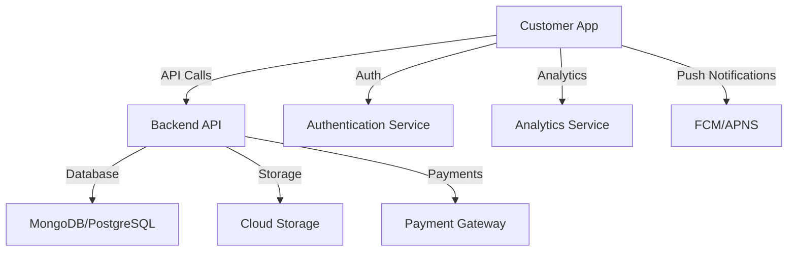
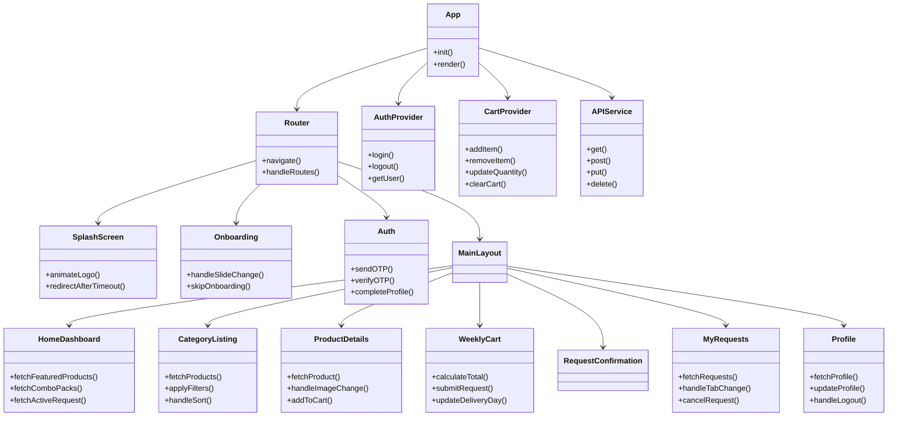
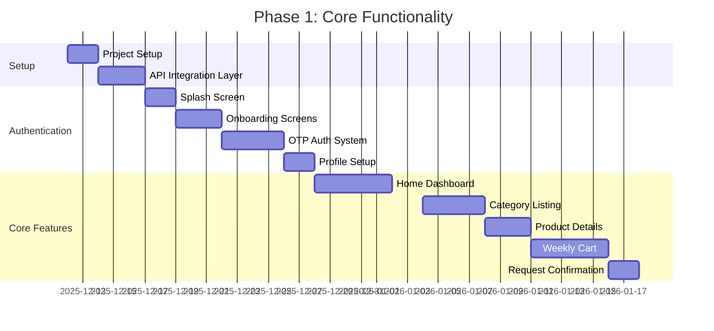
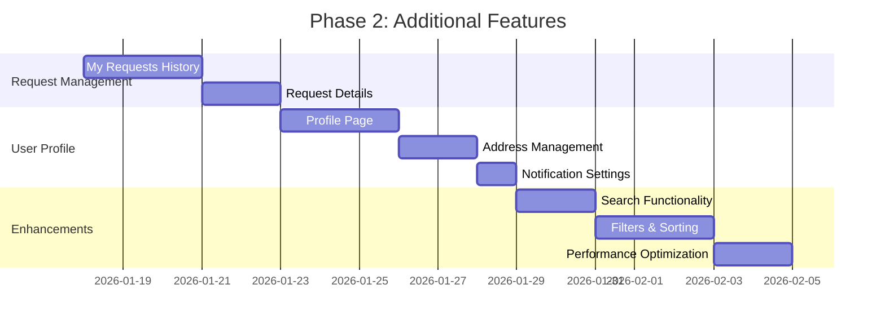
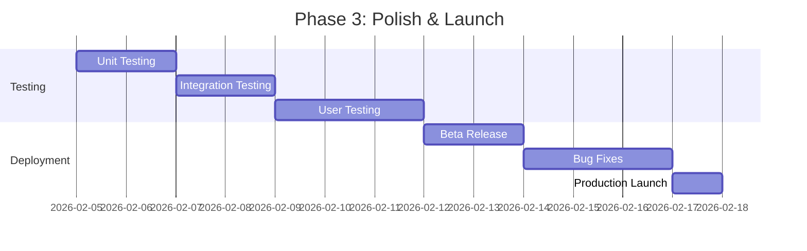
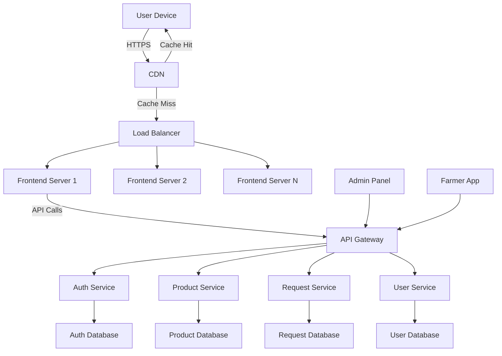

# Technical Architecture - Farm Fresh Customer App

## System Overview



## Component Architecture



## State Management Strategy

### Context API Implementation

```javascript
// AuthContext.js
const AuthContext = createContext();

export const AuthProvider = ({ children }) => {
  const [user, setUser] = useState(null);
  const [loading, setLoading] = useState(true);
  const [token, setToken] = useState(localStorage.getItem('token'));

  const login = async (phone, otp) => {
    try {
      const response = await api.post('/auth/login', { phone, otp });
      const { user, token } = response.data;

      localStorage.setItem('token', token);
      setToken(token);
      setUser(user);
      return { success: true };
    } catch (error) {
      return { success: false, error: error.message };
    }
  };

  const logout = () => {
    localStorage.removeItem('token');
    setToken(null);
    setUser(null);
  };

  const checkAuth = async () => {
    if (token) {
      try {
        const response = await api.get('/auth/me', {
          headers: { Authorization: `Bearer ${token}` }
        });
        setUser(response.data.user);
      } catch (error) {
        logout();
      }
    }
    setLoading(false);
  };

  useEffect(() => {
    checkAuth();
  }, []);

  return (
    <AuthContext.Provider value={{ user, loading, token, login, logout }}>
      {children}
    </AuthContext.Provider>
  );
};

export const useAuth = () => useContext(AuthContext);
```

```javascript
// CartContext.js
const CartContext = createContext();

export const CartProvider = ({ children }) => {
  const [cartItems, setCartItems] = useState([]);

  const addToCart = (item) => {
    setCartItems(prevItems => {
      const existingItemIndex = prevItems.findIndex(i => i.id === item.id);
      if (existingItemIndex >= 0) {
        const updatedItems = [...prevItems];
        updatedItems[existingItemIndex] = {
          ...updatedItems[existingItemIndex],
          quantity: updatedItems[existingItemIndex].quantity + item.quantity
        };
        return updatedItems;
      }
      return [...prevItems, item];
    });
  };

  const updateQuantity = (itemId, newQuantity) => {
    if (newQuantity <= 0) {
      removeItem(itemId);
      return;
    }

    setCartItems(prevItems =>
      prevItems.map(item =>
        item.id === itemId ? { ...item, quantity: newQuantity } : item
      )
    );
  };

  const removeItem = (itemId) => {
    setCartItems(prevItems => prevItems.filter(item => item.id !== itemId));
  };

  const clearCart = () => {
    setCartItems([]);
  };

  const getCartTotal = () => {
    return cartItems.reduce((total, item) => total + (item.price * item.quantity), 0);
  };

  return (
    <CartContext.Provider value={{
      cartItems,
      addToCart,
      updateQuantity,
      removeItem,
      clearCart,
      getCartTotal
    }}>
      {children}
    </CartContext.Provider>
  );
};

export const useCart = () => useContext(CartContext);
```

## API Integration Layer

### API Service Implementation

```javascript
// api.js
import axios from 'axios';

const api = axios.create({
  baseURL: import.meta.env.VITE_API_BASE_URL || 'https://api.farmfresh.com/v1',
  timeout: 10000,
  headers: {
    'Content-Type': 'application/json',
    'Accept': 'application/json'
  }
});

// Request interceptor
api.interceptors.request.use(
  (config) => {
    const token = localStorage.getItem('token');
    if (token) {
      config.headers.Authorization = `Bearer ${token}`;
    }
    return config;
  },
  (error) => Promise.reject(error)
);

// Response interceptor
api.interceptors.response.use(
  (response) => response.data,
  (error) => {
    if (error.response?.status === 401) {
      // Handle unauthorized access
      localStorage.removeItem('token');
      window.location.href = '/auth';
    }
    return Promise.reject(error);
  }
);

export const apiService = {
  // Auth endpoints
  sendOTP: (phone) => api.post('/auth/send-otp', { phone }),
  verifyOTP: (phone, otp) => api.post('/auth/verify-otp', { phone, otp }),
  completeProfile: (profileData) => api.post('/auth/complete-profile', profileData),
  getUserProfile: () => api.get('/auth/me'),
  updateProfile: (profileData) => api.put('/auth/profile', profileData),

  // Product endpoints
  getFeaturedProducts: () => api.get('/products/featured'),
  getComboPacks: () => api.get('/products/combo-packs'),
  getProductsByCategory: (category, filters) => api.get('/products', { params: { category, ...filters } }),
  getProductDetails: (productId) => api.get(`/products/${productId}`),
  searchProducts: (query) => api.get('/products/search', { params: { q: query } }),

  // Request endpoints
  getActiveRequest: () => api.get('/requests/active'),
  getRequestHistory: () => api.get('/requests'),
  getRequestDetails: (requestId) => api.get(`/requests/${requestId}`),
  createRequest: (requestData) => api.post('/requests', requestData),
  cancelRequest: (requestId) => api.delete(`/requests/${requestId}`),

  // Address endpoints
  getAddresses: () => api.get('/addresses'),
  addAddress: (addressData) => api.post('/addresses', addressData),
  updateAddress: (addressId, addressData) => api.put(`/addresses/${addressId}`, addressData),
  deleteAddress: (addressId) => api.delete(`/addresses/${addressId}`),
  setDefaultAddress: (addressId) => api.post(`/addresses/${addressId}/default`),

  // Notification endpoints
  getNotifications: () => api.get('/notifications'),
  markAsRead: (notificationId) => api.post(`/notifications/${notificationId}/read`),
  updateNotificationSettings: (settings) => api.put('/notifications/settings', settings)
};

export default api;
```

## Navigation Structure

### Route Configuration

```javascript
// App.jsx
import { BrowserRouter, Routes, Route, Navigate } from 'react-router-dom';
import { AuthProvider } from './context/AuthContext';
import { CartProvider } from './context/CartProvider';
import SplashScreen from './pages/SplashScreen';
import Onboarding from './pages/Onboarding';
import Auth from './pages/Auth';
import MainLayout from './layouts/MainLayout';
import HomeDashboard from './pages/HomeDashboard';
import CategoryListing from './pages/CategoryListing';
import ProductDetails from './pages/ProductDetails';
import WeeklyCart from './pages/WeeklyCart';
import RequestConfirmation from './pages/RequestConfirmation';
import MyRequests from './pages/MyRequests';
import Profile from './pages/Profile';
import NotFound from './pages/NotFound';

const PrivateRoute = ({ children }) => {
  const { user, loading } = useAuth();

  if (loading) {
    return <div className="min-h-screen flex items-center justify-center">Loading...</div>;
  }

  return user ? children : <Navigate to="/auth" replace />;
};

function App() {
  return (
    <BrowserRouter>
      <AuthProvider>
        <CartProvider>
          <Routes>
            <Route path="/" element={<SplashScreen />} />
            <Route path="/onboarding" element={<Onboarding />} />
            <Route path="/auth" element={<Auth />} />

            <Route path="/app" element={
              <PrivateRoute>
                <MainLayout />
              </PrivateRoute>
            }>
              <Route index element={<HomeDashboard />} />
              <Route path="category/:categoryId" element={<CategoryListing />} />
              <Route path="product/:productId" element={<ProductDetails />} />
              <Route path="cart" element={<WeeklyCart />} />
              <Route path="request-confirmation" element={<RequestConfirmation />} />
              <Route path="requests" element={<MyRequests />} />
              <Route path="profile" element={<Profile />} />
            </Route>

            <Route path="*" element={<NotFound />} />
          </Routes>
        </CartProvider>
      </AuthProvider>
    </BrowserRouter>
  );
}

export default App;
```

## UI Component Library

### Reusable Components

```javascript
// components/ProductCard.jsx
const ProductCard = ({ product }) => {
  const { addToCart } = useCart();
  const navigate = useNavigate();

  const handleAddToCart = (e) => {
    e.stopPropagation();
    addToCart({
      ...product,
      quantity: 1
    });
  };

  return (
    <div
      className="bg-white rounded-xl shadow-sm overflow-hidden hover:shadow-md transition-shadow cursor-pointer"
      onClick={() => navigate(`/product/${product.id}`)}
    >
      <div className="relative">
        
        {product.isOrganic && (
          <span className="absolute top-2 left-2 bg-green-600 text-white px-2 py-1 rounded-full text-xs">
            Organic
          </span>
        )}
      </div>
      <div className="p-3">
        <h3 className="font-medium text-gray-800 truncate">{product.name}</h3>
        <p className="text-sm text-gray-600 mb-2">₹{product.price}/{product.unit}</p>
        <button
          onClick={handleAddToCart}
          className="w-full bg-green-600 text-white py-1.5 rounded-lg text-sm font-medium hover:bg-green-700 transition-colors"
        >
          Add
        </button>
      </div>
    </div>
  );
};
```

```javascript
// components/ComboPackCard.jsx
const ComboPackCard = ({ pack }) => {
  const { addToCart } = useCart();
  const navigate = useNavigate();

  const handleAddToCart = (e) => {
    e.stopPropagation();
    // Add all items in the combo pack to cart
    pack.items.forEach(item => {
      addToCart({
        ...item,
        quantity: 1,
        isComboItem: true,
        comboId: pack.id
      });
    });
  };

  return (
    <div className="bg-white rounded-xl shadow-sm p-4 border border-green-100">
      <div className="flex justify-between items-start mb-3">
        <div>
          <h3 className="font-semibold text-green-800">{pack.name}</h3>
          <p className="text-sm text-gray-600">{pack.items.length} items</p>
        </div>
        <span className="bg-green-100 text-green-800 px-2 py-1 rounded-full text-xs font-medium">
          Save ₹{pack.discount}
        </span>
      </div>

      <div className="flex space-x-2 mb-3">
        {pack.items.slice(0, 4).map((item, index) => (
          
        ))}
        {pack.items.length > 4 && (
          <div className="w-12 h-12 bg-gray-100 rounded-lg flex items-center justify-center text-xs">
            +{pack.items.length - 4}
          </div>
        )}
      </div>

      <div className="flex justify-between items-center">
        <div>
          <p className="text-lg font-bold text-green-800">₹{pack.price}</p>
          <p className="text-xs text-gray-500 line-through">₹{pack.originalPrice}</p>
        </div>
        <button
          onClick={handleAddToCart}
          className="bg-green-600 text-white px-4 py-1.5 rounded-lg text-sm font-medium hover:bg-green-700 transition-colors"
        >
          Add Combo
        </button>
      </div>
    </div>
  );
};
```

## Data Models

### Core Data Structures

```typescript
// User Model
interface User {
  id: string;
  phone: string;
  name: string;
  email?: string;
  addresses: Address[];
  defaultAddressId?: string;
  referralCode?: string;
  createdAt: string;
  updatedAt: string;
  profileCompleted: boolean;
}

// Address Model
interface Address {
  id: string;
  userId: string;
  name: string;
  phone: string;
  addressLine1: string;
  addressLine2?: string;
  city: string;
  state: string;
  pincode: string;
  landmark?: string;
  isDefault: boolean;
  deliveryInstructions?: string;
}

// Product Model
interface Product {
  id: string;
  name: string;
  description: string;
  category: string;
  subcategory?: string;
  price: number;
  unit: string; // kg, liter, dozen, etc.
  images: string[];
  isOrganic: boolean;
  isSeasonal: boolean;
  certification: string;
  benefits: string[];
  farmer?: Farmer;
  deliveryDays: string[]; // Available delivery days
  stock: number;
  rating?: number;
  reviewsCount?: number;
  createdAt: string;
  updatedAt: string;
}

// Farmer Model
interface Farmer {
  id: string;
  name: string;
  image?: string;
  location: string;
  certification?: string;
  yearsOfExperience?: number;
}

// Combo Pack Model
interface ComboPack {
  id: string;
  name: string;
  description: string;
  items: Product[];
  price: number;
  originalPrice: number;
  discount: number;
  image?: string;
  createdAt: string;
  updatedAt: string;
}

// Request Model
interface Request {
  id: string;
  userId: string;
  items: RequestItem[];
  status: 'pending' | 'approved' | 'delivered' | 'cancelled';
  totalAmount: number;
  deliveryDay: string;
  deliveryDate: string;
  createdAt: string;
  updatedAt: string;
  adminNotes?: string;
  cancellationReason?: string;
}

// Request Item Model
interface RequestItem {
  productId: string;
  productName: string;
  quantity: number;
  price: number;
  unit: string;
  image?: string;
  deliveryDay: string;
}

// Notification Model
interface Notification {
  id: string;
  userId: string;
  title: string;
  message: string;
  type: 'request' | 'delivery' | 'promotion' | 'system';
  isRead: boolean;
  relatedId?: string; // requestId, productId, etc.
  createdAt: string;
}
```

## Implementation Roadmap

### Phase 1: Core Functionality (2-3 weeks)



### Phase 2: Additional Features (1-2 weeks)



### Phase 3: Polish & Launch (1 week)



## Development Priorities

### MVP Core Features
1. **Authentication System** - Critical for user identification
2. **Home Dashboard** - Main entry point for users
3. **Product Listing & Details** - Core shopping functionality
4. **Weekly Cart** - Unique selling proposition
5. **Request Submission** - Business critical feature

### Secondary Features
1. Request history and management
2. Profile and address management
3. Advanced filtering and search
4. Notifications system
5. Referral system

## Technical Stack Recommendations

### Frontend
- **Framework**: React 18+ with Vite
- **State Management**: Context API + useReducer
- **Routing**: React Router v6+
- **Styling**: Tailwind CSS with custom theme
- **Animations**: Framer Motion
- **Forms**: React Hook Form
- **Validation**: Zod
- **Icons**: Heroicons or custom SVG

### Backend Integration
- **API Client**: Axios with interceptors
- **Auth**: JWT with refresh tokens
- **Real-time**: Socket.io (for delivery updates)
- **Analytics**: Google Analytics / Mixpanel

### DevOps & Deployment
- **Version Control**: Git with feature branches
- **CI/CD**: GitHub Actions / GitLab CI
- **Hosting**: Vercel / Netlify for frontend
- **Monitoring**: Sentry for error tracking
- **Performance**: Lighthouse audits

## Performance Optimization Strategy

### Key Optimization Areas
1. **Code Splitting**: Route-based lazy loading
2. **Image Optimization**: Compression and responsive images
3. **Caching**: API response caching
4. **Bundle Analysis**: Webpack bundle analyzer
5. **Prefetching**: Route prefetching for better UX

```javascript
// Lazy loading example
const HomeDashboard = lazy(() => import('./pages/HomeDashboard'));
const CategoryListing = lazy(() => import('./pages/CategoryListing'));

// In App.jsx
<Route
  path="/"
  element={
    <Suspense fallback={<LoadingSpinner />}>
      <HomeDashboard />
    </Suspense>
  }
/>
```

## Testing Strategy

### Test Coverage Plan
1. **Unit Tests**: Component rendering and logic
2. **Integration Tests**: Component interactions
3. **E2E Tests**: User flows (Cypress)
4. **API Tests**: Mock API responses
5. **Accessibility Tests**: a11y compliance

```javascript
// Example test with React Testing Library
import { render, screen, fireEvent } from '@testing-library/react';
import ProductCard from './ProductCard';
import { CartProvider } from './CartContext';

describe('ProductCard', () => {
  const mockProduct = {
    id: '1',
    name: 'Organic Tomatoes',
    price: 50,
    unit: 'kg',
    image: 'tomato.jpg',
    isOrganic: true
  };

  it('renders product information correctly', () => {
    render(
      <CartProvider>
        <ProductCard product={mockProduct} />
      </CartProvider>
    );

    expect(screen.getByText('Organic Tomatoes')).toBeInTheDocument();
    expect(screen.getByText('₹50/kg')).toBeInTheDocument();
    expect(screen.getByText('Organic')).toBeInTheDocument();
  });

  it('adds product to cart when button is clicked', () => {
    const addToCart = jest.fn();
    render(
      <CartProvider>
        <ProductCard product={mockProduct} />
      </CartProvider>
    );

    fireEvent.click(screen.getByText('Add'));
    expect(addToCart).toHaveBeenCalledWith(expect.objectContaining({
      id: '1',
      quantity: 1
    }));
  });
});
```

## Deployment Architecture



## Monitoring and Analytics

### Key Metrics to Track
1. **User Engagement**: Session duration, pages per session
2. **Conversion Rates**: Add to cart, request submission
3. **Retention**: Weekly active users, churn rate
4. **Performance**: Page load times, API response times
5. **Business Metrics**: Average order value, request frequency

```javascript
// Analytics service implementation
const Analytics = {
  trackPageView: (pageName) => {
    if (window.gtag) {
      window.gtag('config', 'GA_MEASUREMENT_ID', {
        page_path: pageName
      });
    }
  },

  trackEvent: (eventName, eventData = {}) => {
    if (window.gtag) {
      window.gtag('event', eventName, eventData);
    }
  },

  trackAddToCart: (product) => {
    Analytics.trackEvent('add_to_cart', {
      items: [{
        id: product.id,
        name: product.name,
        price: product.price,
        quantity: 1
      }]
    });
  },

  trackRequestSubmission: (request) => {
    Analytics.trackEvent('submit_request', {
      request_id: request.id,
      total_value: request.totalAmount,
      item_count: request.items.length
    });
  }
};

export default Analytics;
```

## Security Considerations

### Security Best Practices
1. **Authentication**: JWT with short expiration, refresh tokens
2. **Data Protection**: HTTPS everywhere, sensitive data encryption
3. **Input Validation**: Client and server-side validation
4. **API Security**: Rate limiting, CORS restrictions
5. **Storage**: Secure localStorage/sessionStorage usage

```javascript
// Security utilities
export const Security = {
  // Secure token storage
  getToken: () => {
    try {
      return localStorage.getItem('token');
    } catch (e) {
      return null;
    }
  },

  // Input sanitization
  sanitizeInput: (input) => {
    return input
      .trim()
      .replace(/</g, '<')
      .replace(/>/g, '>');
  },

  // Password validation
  validatePassword: (password) => {
    const regex = /^(?=.*[a-z])(?=.*[A-Z])(?=.*\d)(?=.*[@$!%*?&])[A-Za-z\d@$!%*?&]{8,}$/;
    return regex.test(password);
  }
};
```

## Future Enhancements

### Roadmap Beyond MVP
1. **Subscription Management**: Auto-renew, pause, modify subscriptions
2. **Payment Integration**: Multiple payment options, wallets
3. **Loyalty Program**: Points system, rewards
4. **Social Features**: Share products, refer friends
5. **AI Recommendations**: Personalized product suggestions
6. **Multi-language Support**: Regional language options
7. **Dark Mode**: User preference for dark theme
8. **Offline Support**: Limited offline functionality

## Conclusion

This technical architecture provides a comprehensive foundation for building the Farm Fresh customer app. The strategy focuses on:

1. **Modular Design**: Clear separation of concerns
2. **Scalability**: Architecture that can grow with user base
3. **Performance**: Optimized for mobile and web
4. **Maintainability**: Clean code structure and documentation
5. **User Experience**: Intuitive navigation and workflows

The implementation roadmap ensures a phased approach, delivering core functionality first while allowing for future enhancements and scalability.